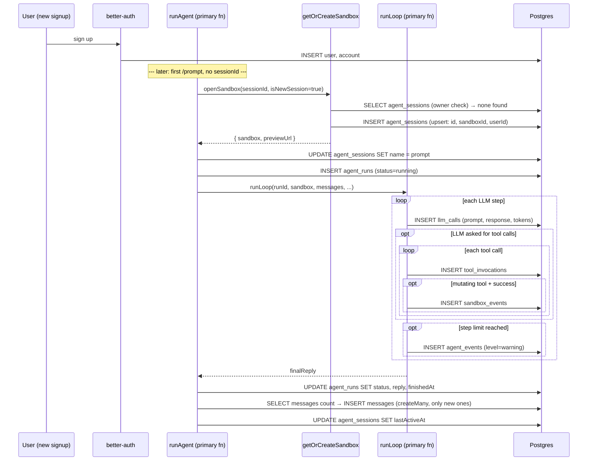
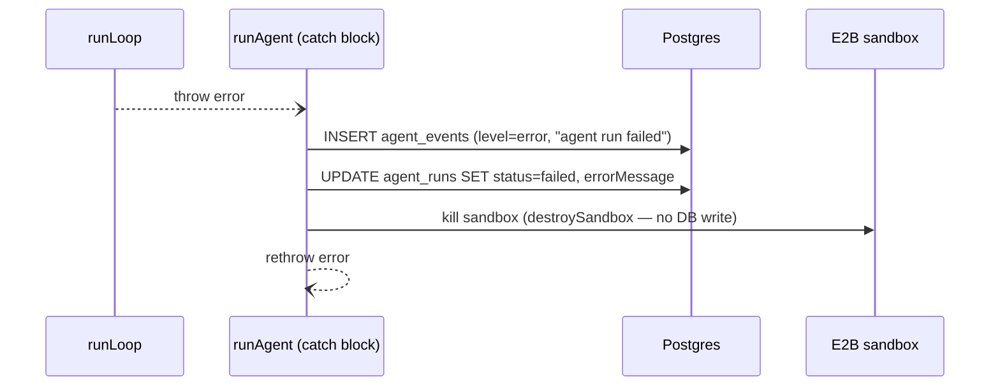
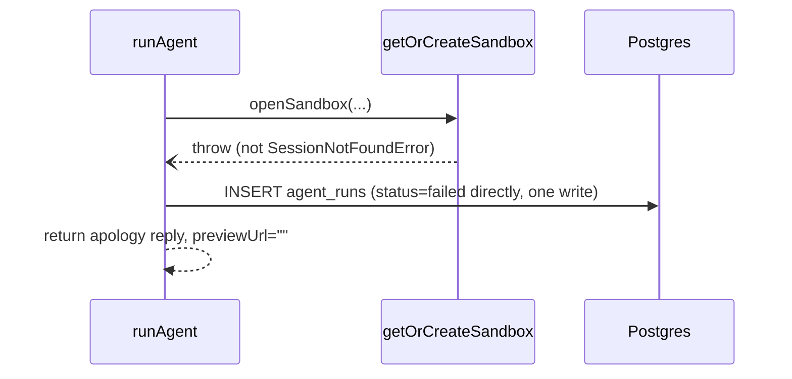
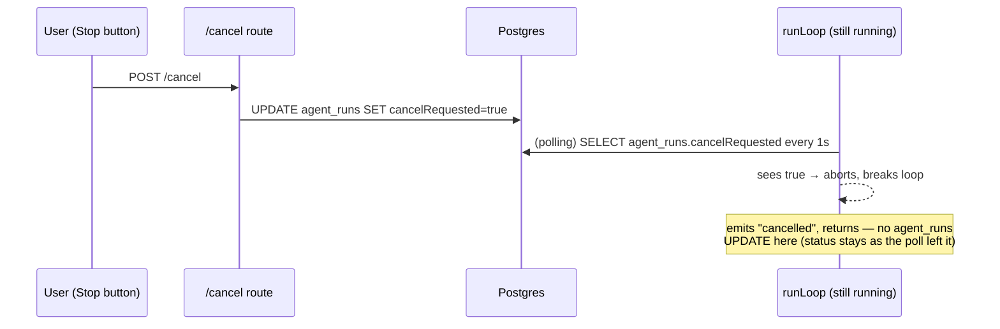

# Agent run — DB writes, table by table

Scope: everything from "brand new user" through one `/prompt` call. Function names/line refs point at `apps/server/src/agent/`.

## 1. Tables touched, in the order they're first written

| \#  | Table                             | Written by                                      | When                                                 |
| --- | --------------------------------- | ----------------------------------------------- | ---------------------------------------------------- |
| 1   | `user` (+ `account`)              | better-auth (`/api/v1/auth/*`)                  | once, at signup                                      |
| 2   | `agent_sessions`                  | `upsertAgentSession` (via `getOrCreateSandbox`) | first prompt with no `sessionId`                     |
| 3   | `agent_sessions` (name)           | `updateAgentSessionName`                        | first prompt only                                    |
| 4   | `agent_runs`                      | `createAgentRun`                                | every prompt, before the loop starts                 |
| 5   | `llm_calls`                       | `createLLMCall`                                 | once per LLM call (each loop step)                   |
| 6   | `tool_invocations`                | `createToolInvocation`                          | once per tool call the LLM makes                     |
| 7   | `sandbox_events`                  | `recordEvent` → `createSandboxEvent`            | once per **successful, mutating** tool call          |
| 8   | `agent_events`                    | `createAgentEvent`                              | only on a warning/error (step-limit hit, run failed) |
| 9   | `agent_runs` (update)             | `updateAgentRun`                                | once, when the loop ends (success/fail/cancelled\*)  |
| 10  | `messages`                        | `saveHistory` → `appendMessages`                | once, after the loop ends                            |
| 11  | `agent_sessions` (`lastActiveAt`) | `updateSession`                                 | once, after the loop ends                            |

\* cancellation is the one case that **skips** `updateAgentRun` — see the cancel path below.

## 2. Happy-path sequence

## 3. Error path — mid-loop failure (the code you selected)

`runLoop` threw something that wasn't a cancellation (real bug, tool crash, LLM provider hard-down). Sandbox already exists and already has a run row — different from the "sandbox never opened" case below.

Why destroy the sandbox here specifically: an unexpected mid-loop failure means we don't know if a tool call left the sandbox's filesystem half- written. Destroying it is safe because every successful mutating tool call was already recorded in `sandbox_events` as it happened — the next prompt rebuilds a fresh sandbox and replays those events instead of trusting whatever state the crashed one was left in.

## 4. Error path — sandbox never opened

This is earlier than case 3 — `openSandbox` itself failed, so there's no sandbox and (usually) no run row yet.

One write, not create-then-update — `createAgentRun`'s optional `failure`param sets `status`/`errorMessage`/`finishedAt` in the same `INSERT`.

If the error **is** `SessionNotFoundError` (unknown/not-yours session id), none of this runs — it's rethrown immediately, no run row at all.

## 5. Cancel path

Cancellation comes in on a **separate** HTTP request (`POST /agent/sessions/:id/cancel`) while the loop above is still running.

Note the asymmetry versus the success/error paths: the cancel branch in `runLoop` returns without going through `updateAgentRun` for the reply text, but `runAgent`'s own `updateAgentRun` call right after `runLoop` returns still runs — it just sees `watcher.signal.aborted === true` and writes `status: "failed"`, `errorMessage: "Cancelled by user"`.
